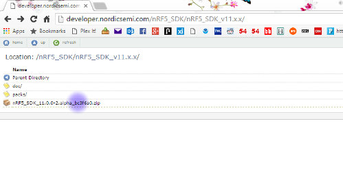

# OSHChip: The Blinky Tutorial

**This short guide will walk you through the toolchain set up and installation of LED blink software on OSHChip**

## Tools you need
- Browser with internet connection
- Computer with MS Windows
- OSHChip

## Tools you will install
- KEIL-MDK 5
- nRF5 SDK Packed version
- nRF5 SDK Zipped version

## 1.  Search for 'KEIL MDK' on a browser.
 

## 2.  Click on 'MDK Version 5 - Keil'
 

## 3.  Click on 'Download & Install'
 

## 4.  Click on 'Download MDK-Core'
 

## 5.  Supply contact information and click on 'Submit'

## 5.  Click on '   ' to finally download the latest KEIL-MDK.
 

## 6.  Point your browser to 'http://developer.nordicsemi.com' and click on 'nRF5_SDK' location.
 

## 7.  Select the latest version of nRF5_SDK (11.x.x in this case)
 

## 8.  Select the Zip file version and then click on 'packs' for packs version.   
We need both packs and zip versions for this tutorial.  

## 9.  Select the packs Zip file
 

## 10. Unzip both fils in a directory/folder.  Each file will create its own subdirectory.  The picture shows the installation help for installing Packs (CMSIS Packs).
 

## 11.  Connect the hardware.  The BLE radio is connected to a USB power and J-Link adapter is plugged into the programming port.  It may install additional drivers at this point.
 

## 12.  Navigate through the Zip file version of the SDK to find the blink program.  It's hidden in examples\peripheral\blinky\pca10028\blank\arm5_no_packs directory.
 

## 13.  Select the blink project file for Keil 5 named 'blinky_blank_pca10028.uvprojx'
 

## 14.  Select the main.c file to reveal the main code.
 

## 15.  Select 'Configure Flash Tools' under 'Flash' option.
 

## 16.  Here's the window that opens for configuration.
 

## 17.  Select 'Debug' tab.
 

## 18.  Select 'J-Link / J-Trace Cortex' on the top right pull-down list.  And then select 'Settings' button.
 

## 19.  Select the Debug tab.
 

## 20.  Select the 'Auto Clk' button.
 

## 21.  Click 'OK' to continue
 

## 22.  Exit the configuration and select 'Project' and 'Build Target' (or hit F7) to compile the blinky program
 

## 23.  No errors or warning shows on the bottom window.
 

## 24.  Select 'Flash' and 'Download' from the menu (or hit F8).
 

## 25.  The programmer should send the program hex file to the radio.
 

## 26.  It works!
 

